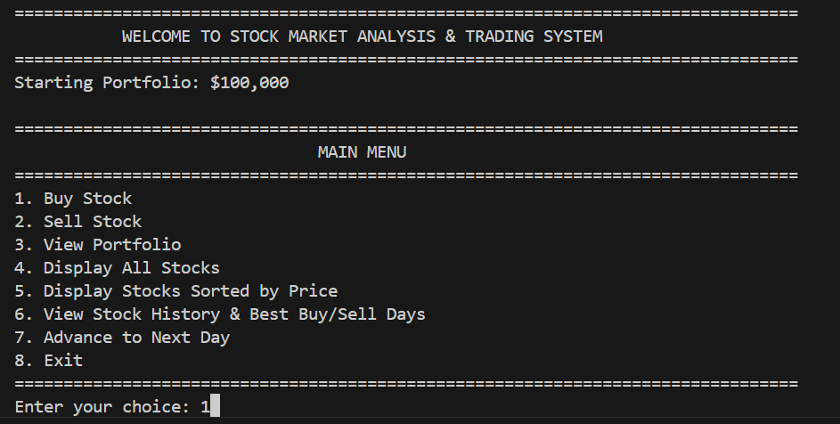
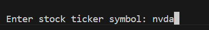
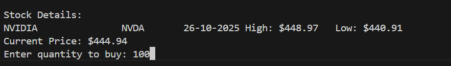
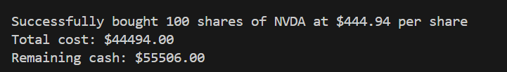

# Stock Market Analysis & Trading System

A comprehensive Java-based stock market simulation system with portfolio management, historical analysis, and performance benchmarking.

## Features

- **Portfolio Management**: Buy and sell stocks, track holdings and net worth
- **Real-time Price Simulation**: Advanced algorithm for realistic daily price changes
- **Historical Analysis**: View stock history and find optimal buy/sell opportunities
- **Custom Data Structures**: Implemented from scratch (ArrayList, HashMap, LinkedList)
- **Performance Benchmarking**: Comprehensive analysis with visualization

## Project Structure
```
stock-market-system/
├── src/stockmarket/
│   ├── models/          # Data models (Stock, Portfolio, Transaction)
│   ├── datastructures/  # Custom implementations (ArrayList, HashMap, etc.)
│   ├── algorithms/      # Core algorithms (Search, Sort, Best Buy/Sell)
│   ├── services/        # Business logic (DataManager, PortfolioManager)
│   ├── ui/             # User interface (MenuSystem)
│   ├── benchmark/      # Performance testing
│   └── Main.java       # Entry point
├── data/
│   └── market2.txt     # Initial stock data
└── plot_benchmark.py   # Visualization script
```
### 🚀 How to Run
Be in the `stock-market-system` directory, then run the following commands in your terminal:

```bash
javac -d out -sourcepath src src/stockmarket/Main.java
java -cp out stockmarket.Main
```
## Complexity Analysis

### 1. Stock Search (Function 1)
- **Algorithm**: HashMap-based lookup
- **Time Complexity**: O(1) average case
- **Space Complexity**: O(n) for storing n stocks
- **Implementation**: Custom HashMap with chaining for collision resolution
- **Use Case**: Finding stocks by ticker symbol instantly

### 2. Best Buy/Sell Finder (Function 2)
- **Algorithm**: Kadane's Algorithm variant (Modified for stock trading)
- **Time Complexity**: O(n) - single pass through history
- **Space Complexity**: O(1) - only storing result indices
- **Implementation**: Tracks minimum price and maximum profit in one iteration
- **Use Case**: Finding maximum profit opportunity from historical data

### 3. Stock Sorter (Function 3)
- **Algorithm**: QuickSort
- **Time Complexity**: O(n log n) average case, O(n²) worst case
- **Space Complexity**: O(log n) - recursion stack depth
- **Implementation**: In-place sorting with pivot partitioning
- **Use Case**: Sorting stocks by current price (ascending/descending)

## Menu Options

1. **Buy Stock** - Purchase shares by entering ticker symbol and quantity
2. **Sell Stock** - Sell shares from your portfolio
3. **View Portfolio** - Display all holdings, profit/loss, and net worth
4. **Display All Stocks** - Show all available stocks with current prices
5. **Display Stocks Sorted by Price** - View stocks sorted ascending or descending
6. **View Stock History & Best Buy/Sell Days** - Analyze historical data for any stock
7. **Advance to Next Day** - Simulate next trading day with randomized prices
8. **Exit** - Close application

## Price Simulation Algorithm

The system uses a **Random Walk with Drift** model for realistic price simulation:
```
Parameters:
- Daily Volatility: 2% (standard deviation)
- Drift: 0.01% (slight upward bias)
- Max Daily Change: ±10%
- Spread Range: 1-4% between high and low
```

**Formula:**
```
change = (gaussian_random * volatility) + drift
new_price = old_price * (1 + change)
```

This creates realistic market movements with:
- Natural price fluctuations
- Occasional large moves
- Prices stay positive
- High/low spread mimics intraday trading

## Custom Data Structures

All data structures implemented **WITHOUT** using Java Collections Framework:

### CustomArrayList
- Dynamic array with automatic resizing
- Doubles capacity when full
- Operations: add O(1), get O(1), remove O(n)

### CustomHashMap
- Hash table with separate chaining
- Load factor: 0.75 (resizes at 75% capacity)
- Operations: put O(1), get O(1), remove O(1) average case

### CustomLinkedList
- Singly linked list
- Operations: addFirst O(1), addLast O(1), get O(n)

## Initial Data Format

The `market2.txt` file format:
```
StockName,Ticker,Date,HighPrice,LowPrice
Apple,AAPL,20-10-2025,172.50,170.10
Microsoft,MSFT,20-10-2025,351.00,348.20
...
```

## Benchmark Results Interpretation

The benchmarking system tests with **5 different input sizes**: 10, 50, 100, 500, 1000 stocks

**Expected Results:**

1. **Stock Search**: 
   - Time should be nearly constant (validates O(1))
   - Space grows linearly with input size

2. **Best Buy/Sell**: 
   - Time grows linearly (validates O(n))
   - Space remains constant

3. **Stock Sort**: 
   - Time grows as n*log(n) (validates O(n log n))
   - Space grows logarithmically (recursion depth)

## 🧪 Test Cases

### ✅ Test Case 1 — Basic Stock Search and Buy






### ✅ Test Case 2 — Best Buy/Sell Prediction
**Input:**
<!-- Add image or description here -->

**Output:**
<!-- Add image or description here -->


### ✅ Test Case 3 — Portfolio Sorting
**Input:**
<!-- Add image or description here -->

**Output:**
<!-- Add image or description here -->


### ✅ Test Case 4 — Multiple Transactions
**Input:**
<!-- Add image or description here -->

**Output:**
<!-- Add image or description here -->


### ✅ Test Case 5 — Large Dataset Handling
**Input:**
<!-- Add image or description here -->

**Output:**
<!-- Add image or description here -->


### ❌ Test Case 6 — Invalid Stock Symbol (Failure Case)
**Input:**
<!-- Add image or description here -->

**Output (Expected Failure):**
<!-- Add image or description here -->


## Dependencies

- **Java**: JDK 8 or higher
- **Python**: 3.x (for visualization only)
- **Python Packages**: 
```bash
  pip install pandas matplotlib
```

## Troubleshooting

### Issue: ClassNotFoundException
**Solution**: Ensure you're running from the correct directory with `-cp bin`

### Issue: market2.txt not found
**Solution**: Place market2.txt in `data/` folder relative to where you run the program

### Issue: CSV not being created
**Solution**: Make sure the `data/` directory exists before running

### Issue: Benchmark graphs not displaying
**Solution**: Install required packages: `pip install matplotlib pandas`

## Future Enhancements

Possible improvements:
- Add transaction history tracking
- Implement stop-loss and limit orders
- Add technical indicators (RSI, MACD, Moving Averages)
- Multi-threaded price simulation
- Persistent storage (database integration)
- Advanced charting (candlestick charts)